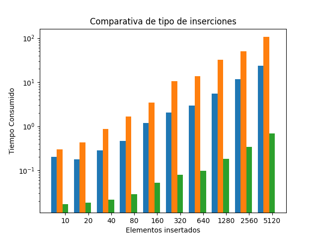

# Intro

Este repo contiene pruebas para montar un cluster mongo

**Índice**

1. [Instalación - Uso](#id1)
2. [Pruebas de carga](#id2)
3. [Pruebas de disponibilidad](#id3)
4.

## 1. Instalación - Uso 

Cada carpeta contiene un docker-compose y todos los ficheros necesarios para las pruebas  
El compose levanta múltiples instancias de mongo configuradas en modo cluster y una instancia de `MongoTester` que se usa para hacer varias pruebas. Esta instancia permite cambiar la configuración de prueba modificando las variables de entorno que se le pasan.  
Los resultados se van a ficheros json en la carpeta `data` donde podemos analizar los resultados.  
El fichero `plot_result.ipybn` contiene un jupyter notebook con un análisis de los resultados

## 2. Pruebas de carga 

### 2.1 Descripción de las pruebas

Las pruebas se ejecutan N veces con un incremento exponencial del tamaño de las operaciones.  
En cada iteración se insertan datos, luego se consultan y finalmente se borran.  
En cuanto a las pruebas de inserción, se inserta de tres formas distintas:

-   Inserción `secuencial`: Una operación para cada elemento
-   Inserción `paralela`: Se divide en 10 threads que hace un insert por segistro
-   Inserción `batch`: Se realizan solo 10 inserciones pero cada una tiene los N registros

### 2.2 Consideraciones generales

Sin importar el tamaño de las pruebas ni la configuraciónd el cluster, la inserción en batch siempre ha sido la más eficiente  

### 2.3 Cluster 3 nodos

## Pruebas de disponibilidad 

| Tipo       | Extra config     | Nodos Caídos | Funciona | Funciona si es el master |
| ---------- | ---------------- | ------------ | -------- | ------------------------ |
| 3 Réplicas |                  | 1            | Sí       | No                       |
| 3 Réplicas |                  | 2            | No       | No                       |
| 3 Réplicas | secondaryOk=true | 2            |          |                          |
| ---        | ---              | ---          | ---      | ---                      |
| 5 Réplicas |                  | 2            |          |                          |
